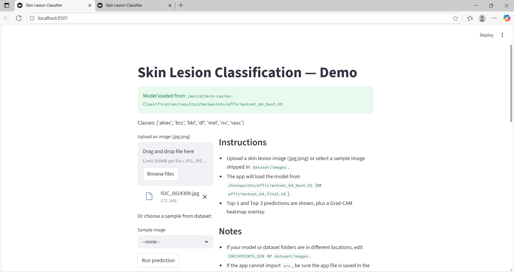
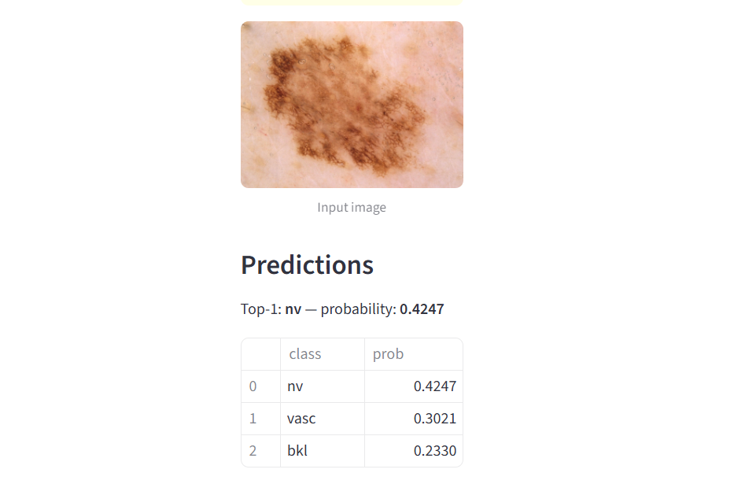
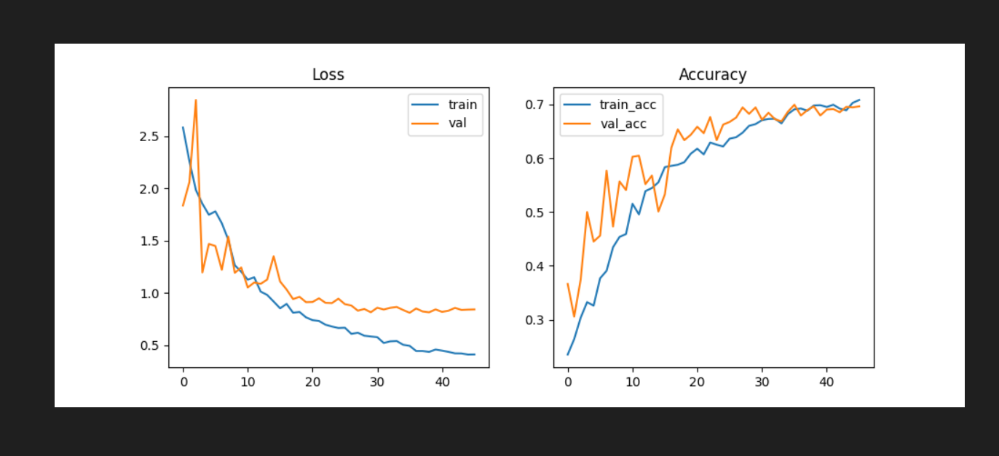

# 🩺 Skin Lesion Classification using Deep Learning

An end-to-end deep learning project for **skin lesion classification** using **EfficientNet (B4)**, trained on dermoscopic images and deployed as an interactive **Streamlit web application**.

This project demonstrates the complete ML pipeline — data preprocessing, model training with GPU acceleration, evaluation, inference, and UI deployment.

---

## 🚀 Features

- 🧠 EfficientNet-B4 based CNN model
- ⚡ GPU-accelerated training using TensorFlow + CUDA
- 📊 Class-weighted training to handle imbalance
- 📈 Training history visualization
- 🖼️ Single-image inference
- 🌐 Streamlit web app for real-time predictions
- 📦 Clean project structure ready for GitHub & resume

---

## 🗂️ Project Structure

Skin-Lesion-Classification/
│
├── data/ # Dataset (not pushed to GitHub)
├── notebooks/ # Experiments & EDA
├── results/
│ ├── class_weights.json
│ └── training_history.png
│
├── screenshots/
│ ├── streamlit_input.png
│ └── streamlit_output.png
│
├── src/
│ ├── models/
│ │ ├── train.py
│ │ └── efficientnet_builder.py
│ ├── evaluate/
│ │ └── inference_single.py
│ └── utils/
│ ├── config.py
│ └── dataset_loader.py
│
├── app_streamlit.py # Streamlit UI
├── sample.jpg # Sample image for testing
├── requirements.txt
├── pyproject.toml
└── README.md


---

## 🧠 Model Details

- **Architecture**: EfficientNet-B4
- **Loss Function**: Categorical Cross-Entropy
- **Optimizer**: Adam
- **Metrics**:
  - Accuracy
  - Top-3 Categorical Accuracy
- **Callbacks**:
  - ModelCheckpoint
  - EarlyStopping
  - ReduceLROnPlateau

---

## 🏋️ Training

Run training using:

```bash
python src/models/train.py


---

## 🧠 Model Details

- **Architecture**: EfficientNet-B4
- **Loss Function**: Categorical Cross-Entropy
- **Optimizer**: Adam
- **Metrics**:
  - Accuracy
  - Top-3 Categorical Accuracy
- **Callbacks**:
  - ModelCheckpoint
  - EarlyStopping
  - ReduceLROnPlateau

---

## 🏋️ Training

Run training using:

```bash
python src/models/train.py

During training:

Best model is saved as
checkpoints/efficientnet_b4_best.h5

Final model is saved as
checkpoints/efficientnet_b4_final.h5

Training plots are saved in
results/training_history.png
```


📊 Model Performance

Validation Accuracy: ~69–70%
Top-3 Accuracy: ~96%

Mdel trained successfully on GPU

🔍 Single Image Inference (CLI)
python src/evaluate/inference_single.py --image path/to/image.jpg


Output:

Predicted class

Probability score

Top-3 predictions with confidence

🌐 Streamlit Web App

Run the UI:

streamlit run app_streamlit.py


Then open in browser:

http://localhost:8501


## 📸 Screenshots

### Streamlit App – Image Upload


### Streamlit App – Prediction Output


### Model Training History



🧪 Sample Prediction
Predicted: nv
Probability: 0.42

Top-3 predictions:
nv     → 0.42
vasc   → 0.30
bkl    → 0.23


🛠️ Tech Stack

Python 3.10+
TensorFlow 2.15
Keras
EfficientNet
NumPy, Pandas, Scikit-Learn
OpenCV, Pillow
Streamlit
CUDA, cuDNN (GPU support)


⚠️ Disclaimer

This project is for educational and research purposes only and should not be used for medical diagnosis.


🙋‍♀️ Author
Sneha Sivakumar
MCA | Machine Learning & Deep Learning